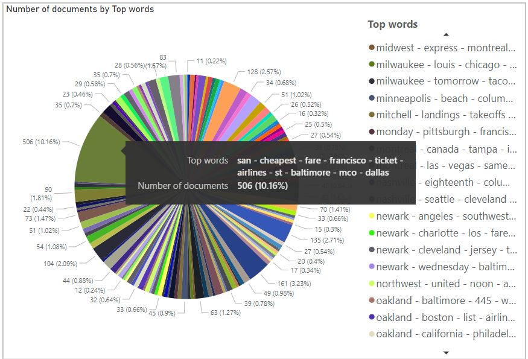

### Topic modeling with BERTopic with or without custom embeddings
This package can be used for topic modeling on values of a text field from a dataframe. We can either utilize a transformer model (from Hugging face model hub) to populate embeddings for the text data and use them with BERTopic or we can populate embeddings any other way (e.g. calling OpenAI API) and use these custom embeddings with BERTopic for the topic modeling.

To run this code and populate sample topic modeling results for `ATIS Intents Kaggle dataset`:
- Install the `bert-tm` package
  - Navigate to the folder containing `setup.py` file
  - Run: `python -m build --sdist --wheel`
  - Navigate to the `dist` folder
  - Run `python -m pip install bert_tm-0.0.0a0-py3-none-any.whl --force-reinstall`
- Navigate to the folder containing `main.py` file
- Run `python main.py --input_path="<Path to the data folder>/data/atis_intents.csv" --output_path="<output path>" --use_embedding=False --text_column="TEXT"`

You can view an  in this snapshot. Please note this current package is not fine-tunned for this specific data. However, BERTopic can be tunned for generating better topic modeling results by testing with different arguments of the `BERTopic` object in `topic_modeling.py` file.